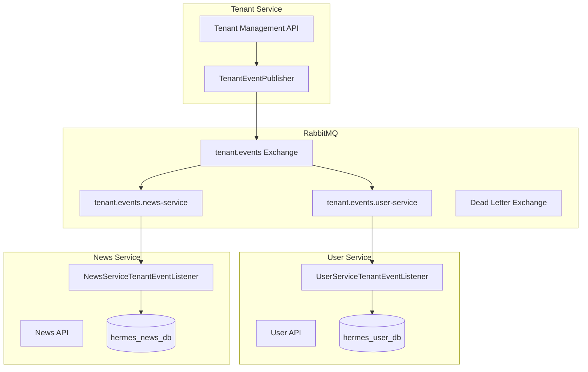

# Multi-tenancy Starter (mt-starter)

## 🚀 NEW! 완전 자동화 버전 (권장)

**의존성 하나 + 설정파일**만으로 멀티테넌시 완성! 

👉 **[완전 자동화 가이드 보기 (README_AUTO.md)](./README_AUTO.md)**

---

## 📚 고전적 방법 (수동 설정)

Spring Boot 마이크로서비스에서 **Schema-per-tenant** 방식의 멀티테넌시를 구현할 수 있는 스타터 모듈입니다.

## 🚀 주요 기능

- **Schema-per-tenant** 방식 멀티테넌시
- JWT 기반 테넌트 식별
- 동적 DataSource 라우팅
- RabbitMQ 기반 이벤트 드리븐 아키텍처
- 스키마 자동 생성 및 관리
- 캐싱 지원
- Spring Boot 3+ 자동 구성

## 📋 사전 요구사항

- Java 17+
- Spring Boot 3.0+
- PostgreSQL
- RabbitMQ
- Spring Cloud (선택사항)

## 🔧 설정 방법

### 1. 의존성 추가

```gradle
dependencies {
    implementation project(':libs:mt-starter')
    implementation 'org.springframework.boot:spring-boot-starter-web'
    implementation 'org.springframework.boot:spring-boot-starter-data-jpa'
    runtimeOnly 'org.postgresql:postgresql'
}
```

### 2. 데이터베이스 설정

**독립된 서비스별 데이터베이스 사용**

```yaml
# application.yml
spring:
  datasource:
    url: jdbc:postgresql://localhost:5432/my_service_db
    username: my_service_user
    password: my_service_password
    driver-class-name: org.postgresql.Driver
  
  jpa:
    hibernate:
      ddl-auto: update
      naming:
        physical-strategy: org.hibernate.boot.model.naming.SnakeCasePhysicalNamingStrategy
    properties:
      hibernate:
        dialect: org.hibernate.dialect.PostgreSQLDialect
```

### 3. 멀티테넌시 설정

```yaml
# application.yml
hermes:
  multitenancy:
    enabled: true
    schema:
      auto-create: true
      validate-on-startup: false
    cache:
      enabled: true
      ttl-minutes: 60
    rabbitmq:
      enabled: true
      tenant-exchange: tenant.events
      max-retry-count: 3
      retry-delay: 5000

spring:
  rabbitmq:
    host: localhost
    port: 5672
    username: guest
    password: guest
    virtual-host: /
    listener:
      simple:
        retry:
          enabled: true
          initial-interval: 1000
          max-attempts: 3
        acknowledge-mode: auto
        prefetch: 1
```

### 4. RabbitMQ 설정 클래스 생성

```java
@Configuration
@ConditionalOnProperty(prefix = "hermes.multitenancy.rabbitmq", name = "enabled", havingValue = "true")
@RequiredArgsConstructor
public class RabbitMQConfig {

    private static final String SERVICE_NAME = "your-service-name"; // 서비스명 변경
    
    private final TenantEventQueueConfigurer queueConfigurer;

    @Bean
    public Queue yourServiceTenantEventQueue() {
        return queueConfigurer.createTenantEventQueue(SERVICE_NAME);
    }

    @Bean
    public Queue yourServiceDeadLetterQueue() {
        return queueConfigurer.createDeadLetterQueue(SERVICE_NAME);
    }

    @Bean
    public Binding yourServiceTenantEventBinding(Queue yourServiceTenantEventQueue, 
                                               TopicExchange tenantEventExchange) {
        return queueConfigurer.createTenantEventBinding(yourServiceTenantEventQueue, tenantEventExchange);
    }

    @Bean
    public Binding yourServiceDeadLetterBinding(Queue yourServiceDeadLetterQueue,
                                              DirectExchange deadLetterExchange) {
        return queueConfigurer.createDeadLetterBinding(yourServiceDeadLetterQueue, deadLetterExchange, SERVICE_NAME);
    }
}
```

### 5. 테넌트 이벤트 리스너 구현

```java
@Component
@Slf4j
public class YourServiceTenantEventListener extends AbstractTenantEventListener {

    private static final String SERVICE_NAME = "your-service-name"; // 서비스명 변경
    
    private final SchemaUtils schemaUtils;

    public YourServiceTenantEventListener(RabbitMQProperties properties, SchemaUtils schemaUtils) {
        super(properties);
        this.schemaUtils = schemaUtils;
    }

    @Override
    protected String getServiceName() {
        return SERVICE_NAME;
    }

    @RabbitListener(queues = "tenant.events.your-service-name") // 큐명 변경
    @Override
    public void handleTenantEvent(TenantEvent event) {
        super.handleTenantEvent(event);
    }

    @Override
    @Transactional
    protected void handleTenantCreated(TenantEvent event) {
        String schemaName = event.getSchemaName();
        
        if (!schemaUtils.schemaExists(schemaName)) {
            log.info("[{}] 새 테넌트 스키마 생성: {}", SERVICE_NAME, schemaName);
            schemaUtils.createSchema(schemaName);
        }
    }

    @Override
    @Transactional
    protected void handleTenantDeleted(TenantEvent event) {
        String schemaName = event.getSchemaName();
        
        if (schemaUtils.schemaExists(schemaName)) {
            log.warn("[{}] 테넌트 스키마 삭제: {}", SERVICE_NAME, schemaName);
            schemaUtils.dropSchema(schemaName);
        }
    }
}
```

## 🎯 사용 방법

### JWT를 통한 테넌트 식별

JWT 토큰에 `tenantId` 필드가 포함되어야 합니다:

```json
{
  "userId": "user123",
  "email": "user@company1.com",
  "tenantId": "company1",
  "role": "USER",
  "iat": 1640995200,
  "exp": 1641081600
}
```

### HTTP 헤더를 통한 테넌트 지정 (선택사항)

```http
X-Tenant-ID: company1
```

### 엔티티 정의

일반적인 JPA 엔티티처럼 정의하면 자동으로 테넌트별 스키마에서 관리됩니다:

```java
@Entity
@Table(name = "users")
@Getter @Setter
public class User {
    @Id
    @GeneratedValue(strategy = GenerationType.IDENTITY)
    private Long id;
    
    @Column(nullable = false, unique = true)
    private String email;
    
    @Column(nullable = false)
    private String name;
}
```

### Repository 사용

일반적인 Spring Data JPA Repository처럼 사용하면 됩니다:

```java
@Repository
public interface UserRepository extends JpaRepository<User, Long> {
    Optional<User> findByEmail(String email);
    List<User> findByNameContaining(String name);
}
```

## 🏗️ 아키텍처 개요



## 🔧 고급 설정

### 캐싱 설정

```yaml
hermes:
  multitenancy:
    cache:
      enabled: true
      ttl-minutes: 60
      max-size: 1000
```

### 스키마 검증

```yaml
hermes:
  multitenancy:
    schema:
      validate-on-startup: true
      create-if-missing: true
```

### 로깅 설정

```yaml
logging:
  level:
    com.hermes.multitenancy: DEBUG
  pattern:
    console: "%d{HH:mm:ss.SSS} [%thread] %-5level [%X{tenantId:-system}] %logger{36} - %msg%n"
```

## 🚨 주의사항

1. **데이터베이스 분리**: 각 서비스는 독립된 데이터베이스를 사용해야 합니다.
2. **스키마 명명**: 스키마명은 `tenant_{tenantId}` 형식을 따릅니다.
3. **RabbitMQ 의존성**: RabbitMQ가 실행 중이어야 테넌트 이벤트 처리가 가능합니다.
4. **트랜잭션**: 스키마 생성/삭제는 트랜잭션으로 처리됩니다.

## 🐛 문제 해결

### RabbitMQ 연결 실패

```bash
# RabbitMQ 상태 확인
sudo systemctl status rabbitmq-server

# RabbitMQ 시작
sudo systemctl start rabbitmq-server

# 관리 UI 활성화 (http://localhost:15672)
sudo rabbitmq-plugins enable rabbitmq_management
```

### 스키마 생성 실패

로그를 확인하여 데이터베이스 권한과 연결을 확인하세요:

```yaml
logging:
  level:
    com.hermes.multitenancy.util.SchemaUtils: DEBUG
```

### Dead Letter Queue 확인

메시지 처리 실패 시 DLQ를 확인하세요:

- Queue: `tenant.events.dlq.{service-name}`
- Exchange: `tenant.events.dlx`

## 📚 추가 리소스

- [Spring Boot Multi-tenancy Guide](https://spring.io/guides/gs/multi-tenancy/)
- [RabbitMQ Documentation](https://www.rabbitmq.com/documentation.html)
- [PostgreSQL Schema Documentation](https://www.postgresql.org/docs/current/ddl-schemas.html)

## 🤝 기여

새로운 기능이나 버그 수정은 Pull Request를 통해 기여해 주세요.

## 📄 라이센스

이 프로젝트는 MIT 라이센스 하에 있습니다.